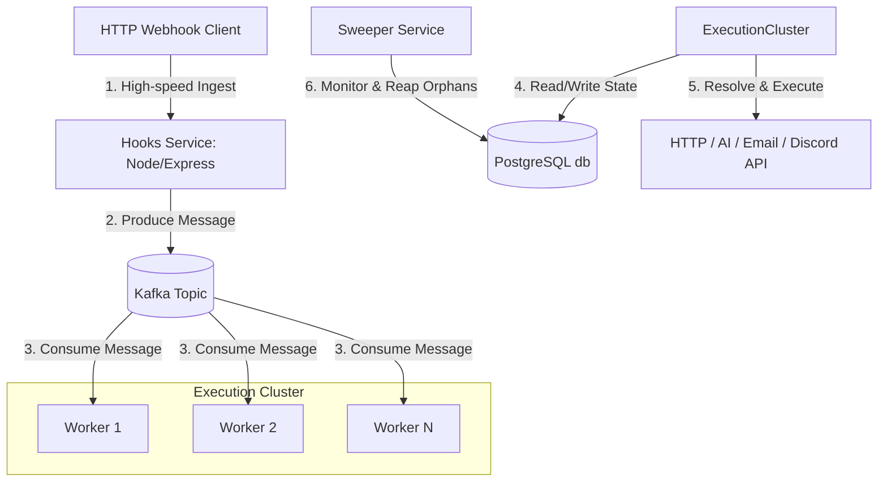

# Orchestrix

Orchestrix is a self-hosted, distributed workflow automation engine built to ingest high-throughput webhook events, map dynamic variables across execution pipelines, and execute multi-step integration sequences.

The project is structured as an event-driven microservices architecture to decouple high-volume ingestion from asynchronous process execution.

---

## Technical Architecture & Design Decisions

Orchestrix is split into five decoupled services to guarantee system stability and horizontal scaling under load:



### 1. Ingestion Layer (`/hooks`)
* **Core Problem**: Slow external integration endpoints (e.g., waiting for SMTP or LLM responses) should never block or bottleneck incoming webhook requests.
* **Solution**: The `hooks` service is a lean HTTP server focused solely on validating inbound requests, immediately publishing the payload to a **Kafka topic**, and returning a `200 OK`.

### 2. Message Broker (`Apache Kafka`)
* **Role**: Serves as a distributed, partition-backed event log. It buffers incoming payloads, guarantees log durability, and enables concurrent consumer groups to process workflows out of order or sequentially as needed.

### 3. Execution Engine (`/worker`)
* **Role**: Horizontal scaling consumer cluster. Workers consume events from Kafka, compile variables, and handle network integrations.
* **Variable Resolution Engine**: Implements dynamic parsing of nested payloads. Variables stored as `{body.user.profile.email}` or `{step1.response.data.id}` are resolved dynamically at runtime by evaluating the execution context tree.

### 4. Database Schema & State Machine (`/primary-backend`)
* **Backend**: An Express API managing CRUD operations, authentications, and Zap blueprints.
* **Prisma + PostgreSQL**: Models relationships between Zaps, Triggers, Actions, and Runs. Designed with strict indexing on foreign keys (`zapId`, `userId`) to optimize lookups in run histories.

### 5. Watchdog / Recovery (`/sweeper`)
* **Core Problem**: Distributed transactions are prone to network timeouts or worker crashes, leaving jobs stuck in an "IN_PROGRESS" state.
* **Solution**: A cron-like utility that polls the database for orphaned runs, analyzes execution time thresholds, and schedules retries or graceful failures to ensure system-wide consistency.

---

## Engineering Features

* **Dynamic AST Variable Mapping**: Resolves nested JSON payload paths at runtime to interpolate parameters between arbitrary workflow steps.
* **Distributed Queue Isolation**: Separates the API dashboard, webhook receiver, and worker executors to prevent high workflow volumes from affecting dashboard UI load times.
* **Test Sandboxes**: Allows developers to dry-run and mock HTTP configurations, AI prompts, and Discord payload runs before publishing.
* **Premium Theme UI**: Optimized Next.js dashboard featuring state visualization, layout builders, and dark-theme configurations.

---

## Database Schema Model (Prisma)

The relations are modeled to handle sequential execution flows:

```prisma
model Zap {
  id        String   @id @default(uuid())
  triggerId String
  trigger   Trigger?
  actions   Action[]
  runs      ZapRun[]
}

model Action {
  id         String          @id @default(uuid())
  zapId      String
  zap        Zap             @relation(fields: [zapId], references: [id])
  type       AvailableAction @relation(fields: [actionId], references: [id])
  actionId   String
  sorting    Int             // Guarantees sequence order
}
```

---

## Development Setup

### System Prerequisites
- **Node.js** (v18.x or above)
- **PostgreSQL** (v15.x or above)
- **Apache Kafka** (v3.x or above)

### 1. Clone & Dependencies
```bash
git clone https://github.com/your-username/Orchestrix.git
cd Orchestrix
```

### 2. Seeding Action Definitions
```bash
cd primary-backend
# Set environment variables in .env
npx prisma db push
npx tsx src/db/seed.ts
```

### 3. Launching Services
Run the following in separate terminals to start the distributed system locally:

```bash
# Ingestion
cd hooks && npm run dev

# Worker Executor
cd worker && npm run dev

# Database API
cd primary-backend && npm run dev

# Frontend App
cd frontend && npm run dev
```
